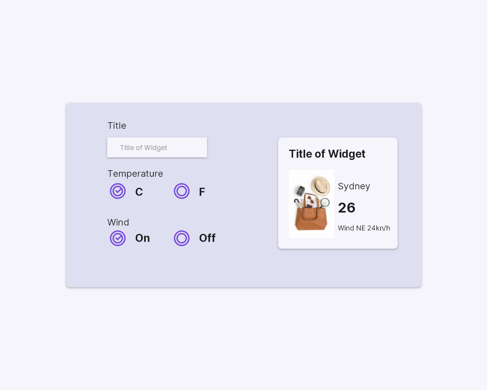
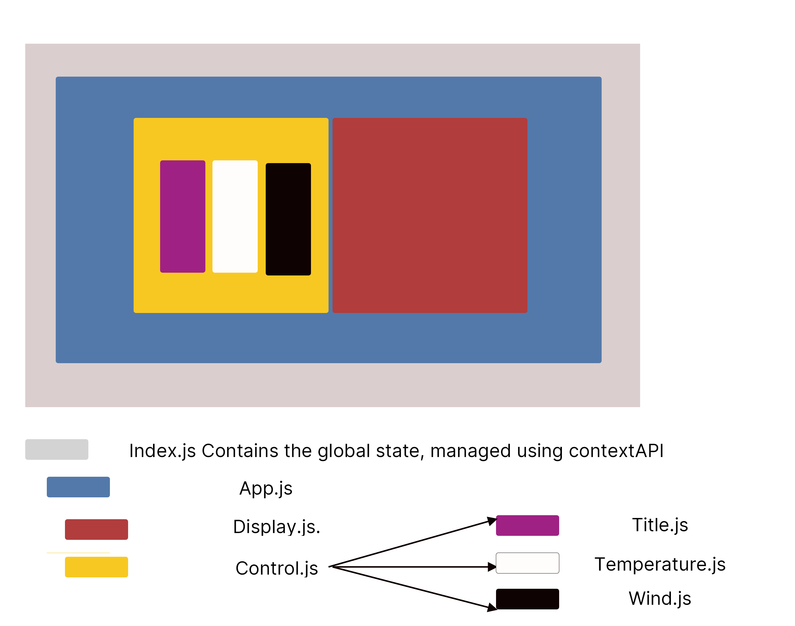

## Design Objectives
The widget editor must have a form to allow a user to create a new widget. This form must include the following fields:
* Title
* Unit: metric or imperial
* Show Wind: true or false

## Thought Process
The design was done in the following steps
* User requirements were converted into user stories:
    * User can edit the title
    * User can swith between celcius and fahrenheit
    * User can swith wind on and off
    * User can view widget on screen
* Wireframe - The wireframe was made using free hand skectch
* Mockup - A mockup of the application was made using **Lunacy** (See sketch below)

* Code the application using ReactJS to match specification,

## Language Choice
I chose ReactJS for this project for few reasons highlighted below:
* Ability to use the state functionalities of ReactJS, to minimize number of API, calls.
* Previous experience in ReactJS

## Assumptions
* The end user of this application only needs to view the widget on his browser. The application does not implement a feature to generate a widget that could be exported (e.g. as an image)
* The title of the widget is limited to at most 3/4 words. The title section of the widget has been set to "overflow: hidden" to ignore display of additional characters
* The minimum screen width for the end user is 470 px. The application is optimized to tile the form and the widget horizontally as the screen size becomes smaller

## Testing
* Testing was implemented for some of the components to confirm the right components were rendered on the screen.
* The plan is to implements full test coverage for this application prior to deplyment

## Miscellaneous Design Images

